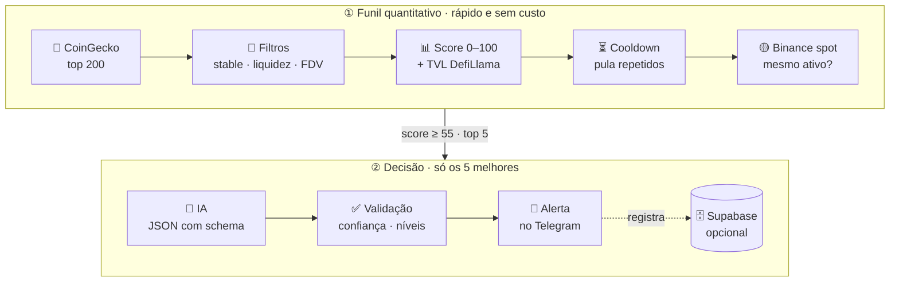

<a id="topo"></a>
<div align="center">

# 📡 Crypto Radar


*Um radar privado que varre o mercado cripto de hora em hora e só te chama quando algo passa em todos os filtros.*

[](https://www.python.org/)
[](https://core.telegram.org/bots)
[](https://platform.openai.com/docs/guides/structured-outputs)
[](https://www.coingecko.com/en/api)
[](https://www.binance.com/)
[](https://supabase.com/)
[](#)

</div>

---

> [!WARNING]
> **O radar não compra, não vende e não é recomendação financeira.** Ele gera *zonas de referência para pesquisa* a partir de dados públicos e de um modelo de IA. Quem decide se entra, quanto e quando é você.

## <a id="sobre"></a>💡 Sobre o projeto

A maioria dos "bots de sinal" cripto faz o contrário do que deveria: grita toda vez que algo sobe 20%. O **Crypto Radar** foi desenhado para o oposto — procurar **ativos líquidos, pouco diluídos e com protocolo em uso real que estão recuando ou lateralizando**, e só então pedir a opinião de uma IA conservadora.

Não existe dashboard. Tudo acontece num chat do Telegram: os alertas chegam lá, os comandos saem de lá e, se algo quebrar (API fora do ar, chave inválida), é lá que você fica sabendo.

**Pra quem é:** quem quer um filtro disciplinado rodando sozinho, em vez de ficar rolando lista de moeda o dia inteiro — e sabe ler um alerta como ponto de partida de pesquisa, não como ordem.

## <a id="exemplo"></a>📨 Como chega um alerta

```text
🟢 OPORTUNIDADE — PENDLE

Entrada: $2.55 – $2.65
Onde: Binance (PENDLEUSDT) · agora $2.6
Risco: Médio
Limite configurado: R$ 600,00

🎯 Referência: $3.1 (+19.2%)
🛑 Invalidação: $2.35 (-9.6%)
⚖️ Retorno/risco: 2,0

Pullback de 7d com TVL crescendo e diluição baixa.

⚠️ Zonas de referência, não garantias.
Confiança do radar: 72%
```

<sub>Exemplo ilustrativo. O "limite configurado" é o teto por posição que *você* define no `.env` — a IA nunca decide quanto do seu patrimônio arriscar.</sub>

## 🧭 Índice

- [💡 Sobre o projeto](#sobre)
- [📨 Como chega um alerta](#exemplo)
- [🚀 Comece por aqui](#comece)
- [🗺️ Como o radar pensa](#fluxo)
- [🤖 Comandos](#comandos)
- [⚙️ Configuração](#configuracao)
- [🛡️ Segurança](#seguranca)
- [🧱 Estrutura do código](#estrutura)
- [📚 Documentação completa](#docs)
- [🛣️ Roadmap](#roadmap)

---

## <a id="comece"></a>🚀 Comece por aqui

Na primeira vez, siga o **[guia de instalação completo](docs/01-instalacao.md)** — ele cobre BotFather, chaves, ID do grupo e os problemas mais comuns. A versão curta:

```bash
git clone https://github.com/grupoapex135/criptoalerts.git
cd criptoalerts
python3.11 -m venv .venv && source .venv/bin/activate
pip install -r requirements.txt
cp .env.example .env          # preencha TELEGRAM_BOT_TOKEN e OPENAI_API_KEY

python smoke_test.py --ai     # confere APIs, token do Telegram e uma análise real
python main.py                # sobe o bot; mande /id no chat e cole em TELEGRAM_CHAT_ID
```

| Você vai precisar de | Custo |
|---|---|
| Bot do Telegram (via [@BotFather](https://t.me/BotFather)) | Grátis |
| Chave da [OpenAI](https://platform.openai.com/api-keys) | **Pago** — único custo do projeto |
| Chave Demo do [CoinGecko](https://www.coingecko.com/en/api/pricing) | Grátis (opcional, evita erro 429) |
| DefiLlama e Binance (dados públicos) | Grátis, sem chave |
| [Supabase](https://supabase.com/) para histórico | Grátis (opcional) |

<div align="right"><a href="#topo">▲ voltar ao topo</a></div>

## <a id="fluxo"></a>🗺️ Como o radar pensa

A cada ciclo (60 min por padrão), o radar afunila 200 ativos até, no máximo, um punhado de alertas. A IA é cara e lenta, então ela só vê o que já sobreviveu aos filtros baratos — e mesmo a resposta dela é conferida pelo código antes de virar mensagem.



| Etapa | O que acontece |
|---|---|
| **Filtros eliminatórios** | Saem stablecoins, tokens embrulhados/staking, ativos lastreados (ouro, fundos de treasury), market cap < US$ 100M, volume < US$ 5M/dia e FDV > 3× o market cap. |
| **Score quantitativo** | Começa em 35. Ganha pontos por pullback de 7d, liquidez, pouca diluição e 30d não esticado; perde por alta vertical em 24h/30d. |
| **TVL (DefiLlama)** | Protocolo com TVL relevante e crescendo soma pontos; TVL encolhendo tira. Corretoras e colisões de ticker são ignoradas. |
| **Binance** | Exige par `USDT` spot e preço batendo com o CoinGecko (±5%) — mesmo ticker pode ser outro token. |
| **IA** | Os 5 melhores (score ≥ 55) vão para a OpenAI, que responde em JSON validado por schema: alertar ou não, confiança, risco e níveis. |
| **Validação** | Só vira alerta com confiança ≥ 65%, invalidação < entrada < alvo e entrada a até 10% do preço atual. |

A tabela de pontos completa, a lógica do DefiLlama e os **pontos cegos** do radar estão em **[Como o radar decide](docs/02-como-o-radar-decide.md)**.

<div align="right"><a href="#topo">▲ voltar ao topo</a></div>

## <a id="comandos"></a>🤖 Comandos

| Comando | O que faz |
|---|---|
| `/scan` | Roda uma varredura agora e mostra até 3 oportunidades + resumo (quantos a IA avaliou, descartes, erros) |
| `/analyze PENDLE` | Analisa um ativo específico do top 200, mesmo que ele não tenha passado nos filtros |
| `/status` | Saúde do radar: última varredura, erros, próxima execução, filtros ativos |
| `/id` | Mostra o ID do chat — usado na configuração |

Também funciona em texto livre: `analisa PENDLE`, `olha SOL`.

Além dos comandos, o bot fala sozinho em três situações: quando **inicia** (🟢 Crypto Radar iniciado), quando **encontra uma oportunidade** e quando **algo quebra** — este último no máximo uma vez a cada 3 horas, para uma API fora do ar não virar spam.

## <a id="configuracao"></a>⚙️ Configuração

Tudo mora no `.env` (modelo em [`.env.example`](.env.example)). Os ajustes de estratégia:

| Variável | Padrão | Para que serve |
|---|---|---|
| `SCAN_INTERVAL_MINUTES` | `60` | Intervalo entre varreduras automáticas |
| `TOP_COINS_TO_SCAN` | `200` | Quantos ativos (por market cap) entram no funil |
| `MAX_AI_CANDIDATES` | `5` | Teto de análises de IA por varredura — controla o custo |
| `MIN_MARKET_CAP_USD` | `100000000` | Market cap mínimo |
| `MIN_DAILY_VOLUME_USD` | `5000000` | Volume diário mínimo |
| `MAX_FDV_TO_MCAP_RATIO` | `3` | Diluição máxima aceita (FDV ÷ market cap) |
| `MIN_SCORE_TO_AI` | `55` | Nota mínima para chegar à IA |
| `MIN_CONFIDENCE_TO_ALERT` | `65` | Confiança mínima da IA para virar alerta |
| `ALERT_COOLDOWN_HOURS` | `24` | Tempo até o mesmo ativo poder ser alertado de novo |
| `CAPITAL_BRL` / `MAX_POSITION_PCT` | `20000` / `3` | Só para exibir o teto por posição (ex.: 3% de R$ 20 mil = R$ 600) |

> [!TIP]
> Quer menos alertas e mais convicção? Suba `MIN_CONFIDENCE_TO_ALERT` para 75. Quer gastar menos com IA? Baixe `MAX_AI_CANDIDATES` para 3.

## <a id="seguranca"></a>🛡️ Segurança

- **Só o chat configurado manda no bot.** Qualquer outra pessoa que achar o bot recebe "Bot privado." — ninguém gasta seus créditos da OpenAI. Em grupo, todos os membros podem usar.
- **Nenhuma chave no repositório.** O `.env` está no `.gitignore`.
- **Token do Telegram fora dos logs.** A biblioteca HTTP registraria a URL com o token; o nível de log dela é rebaixado.
- **Supabase com RLS ligado.** Só a chave secreta (o bot) lê e escreve as tabelas; a chave pública não acessa nada.
- **Binance só leitura.** Usa o endpoint público de dados de mercado — o bot não tem nenhuma chave de conta de exchange.

## <a id="estrutura"></a>🧱 Estrutura do código

```text
criptoalerts/
├── main.py             # entrada: logging + sobe o bot
├── config.py           # lê o .env
├── providers.py        # clientes CoinGecko, DefiLlama e Binance
├── scoring.py          # filtros eliminatórios e score quantitativo
├── radar.py            # pipeline: varredura → IA → validação
├── ai_analyzer.py      # OpenAI com Structured Outputs (JSON Schema estrito)
├── database.py         # Supabase + cooldown em memória
├── telegram_app.py     # comandos, varredura agendada, /status, avisos de erro
├── smoke_test.py       # checagem de setup contra as APIs reais
├── tests/test_core.py  # testes de regressão, sem rede
├── schema.sql          # tabelas do Supabase (com RLS)
├── docs/               # guias detalhados
└── .env.example
```

```bash
python -m unittest discover -s tests   # 26 testes, nenhum acessa a internet
```

<div align="right"><a href="#topo">▲ voltar ao topo</a></div>

---

## <a id="docs"></a>📚 Documentação completa

| Guia | O que tem |
|---|---|
| **[01 — Instalação](docs/01-instalacao.md)** | Do zero ao primeiro alerta: BotFather, OpenAI, CoinGecko Demo, ID do grupo, Supabase, smoke test e solução dos erros mais comuns. |
| **[02 — Como o radar decide](docs/02-como-o-radar-decide.md)** | A tabela de pontos inteira, como o DefiLlama é pareado sem falsos positivos, as regras da IA, a validação final e — com honestidade — o que o radar **não** enxerga. |
| **[03 — Operação e deploy](docs/03-operacao-e-deploy.md)** | Anatomia do alerta, leitura do `/status`, custos, cooldown, e o que considerar para deixar o radar rodando 24/7 num servidor. |

## <a id="roadmap"></a>🛣️ Roadmap

- [x] Varredura com filtros, score e TVL
- [x] IA com resposta estruturada e validação dos níveis no código
- [x] Operação 100% Telegram com `/status` e avisos de erro
- [ ] **Filtro de regime pelo BTC** — segurar alertas quando o mercado inteiro estiver em queda forte
- [ ] **Placar dos sinais** — registrar se cada alerta bateu alvo ou invalidação e mostrar a taxa de acerto no `/status`
- [ ] Calendário de unlocks e receita/fees dos protocolos
- [ ] Backtest dos pesos do score
- [ ] Deploy 24/7 documentado

<div align="center">

<br/>

Feito com 🤖 + ☕, um candle de cada vez.

<a href="#topo">▲ voltar ao topo</a>

</div>
