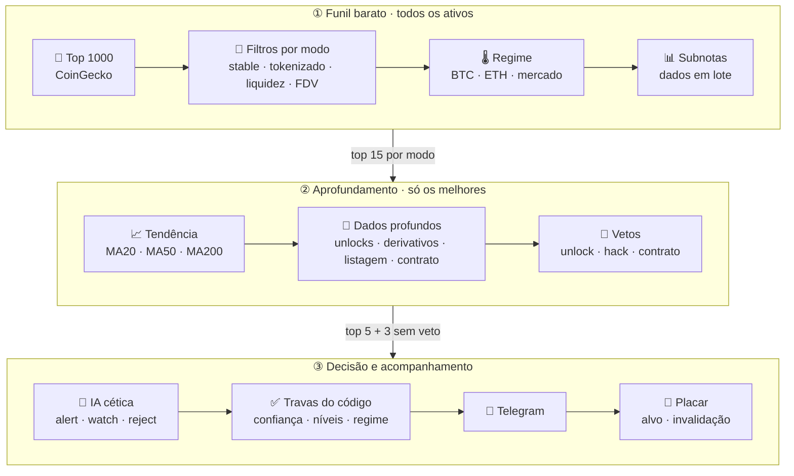

<a id="topo"></a>
<div align="center">

# 📡 Crypto Radar


*Um radar privado que cruza oito tipos de evidência antes de te chamar — e depois conta, sem esconder, se acertou.*

[](https://www.python.org/)
[](https://core.telegram.org/bots)
[](https://platform.openai.com/docs/guides/structured-outputs)
[](https://www.coingecko.com/en/api)
[](https://www.binance.com/)
[](https://supabase.com/)
[](#testes)
[](#)

</div>

---

> [!WARNING]
> **O radar não compra, não vende e não é recomendação financeira.** Ele gera *zonas de referência para pesquisa* a partir de dados públicos e de um modelo de IA, e não prevê o futuro. Quem decide se entra, quanto e quando é você.

## <a id="sobre"></a>💡 Sobre o projeto

"Caiu bastante, então compra" não é tese — é esperança. O **Crypto Radar** só levanta a mão quando várias evidências independentes apontam na mesma direção:

> ativo líquido **+** fundamentos melhorando **+** tokenomics aceitável **+** sem unlock pesado chegando **+** mercado geral saudável **+** derivativos sem alavancagem excessiva **+** preço numa zona interessante

O radar trabalha em **dois modos**, lado a lado:

- **🟢 BINANCE** — ativos que já estão no spot da Binance (top 200).
- **🚀 PRÉ-BINANCE** — ativos **com fundamento que ainda não estão no spot da Binance** (US$ 10M a US$ 1B, top 1000), pontuados pelos sinais que costumam anteceder uma listagem: Binance Alpha, portfólio YZi Labs (ex-Binance Labs), programas da Binance, perpétuo na Binance Futures sem spot e corretoras tier-1. Inclui tokens de DEX, sempre com checagem do contrato.

> [!IMPORTANT]
> Ninguém sabe o que a Binance vai listar — ela não publica isso. O modo Pré-Binance **não prevê listagens**: ele encontra ativos com fundamento fora da Binance e mostra os indícios. O placar registra, sem esconder, quantos sinais foram de fato listados depois.

A complexidade fica no backend. No Telegram chega uma mensagem curta, feita para decidir rápido — e o relatório completo só quando você pede (`/detalhe`). Não existe dashboard — alertas, comandos, placar e avisos de erro acontecem no chat.

## <a id="exemplo"></a>📨 Como chega um alerta

Curto, para decidir em segundos: veredito, uma linha do que o projeto faz, até 3 pontos a favor e 3 contra, e o plano. O relatório completo (tese, valuation, técnico, macro, sinais de listagem) vem só quando você pede, com `/detalhe`.

```text
🟢 OPORTUNIDADE · 🚀 PRÉ-BINANCE
$FLUID — Fluid
Lending e DEX na mesma liquidez; parte da receita volta aos holders.

✅ Binance Alpha · Perp na Binance · Receita +24%
⚠️ Top 10 com 53%

Entrada $3.90–$4.05 · Upbit, Bybit, DEX
🎯 $5.20 (+30.0%) · 🛑 $3.40 (-15.0%)
Risco Médio · Confiança 72% · Limite R$ 600,00

Detalhes: /detalhe FLUID
```

<sub>Exemplo ilustrativo. 🟢 BINANCE = já listada · 🚀 PRÉ-BINANCE = ainda fora do spot da Binance. A linha do projeto é escrita pela IA **só a partir da descrição e das categorias oficiais** (CoinGecko/DefiLlama). Os ✅/⚠️ são escolhidos pelo código a partir dos dados, não pela IA. O "limite" é o teto por posição do seu `.env` e cai pela metade com o mercado em risco.</sub>

## 🧭 Índice

- [💡 Sobre o projeto](#sobre) · [📨 Como chega um alerta](#exemplo)
- [🚀 Comece por aqui](#comece)
- [🗺️ Arquitetura](#arquitetura) · [🧩 As oito camadas](#camadas) · [🔌 Provedores](#provedores)
- [🤖 Comandos](#comandos) · [🎯 Placar dos sinais](#placar)
- [⚙️ Configuração](#configuracao) · [🧪 Testes](#testes) · [🛡️ Segurança](#seguranca)
- [🧱 Estrutura do código](#estrutura) · [➕ Adicionando uma API](#nova-api)
- [⚠️ Limitações conhecidas](#limitacoes) · [📚 Documentação](#docs) · [🛣️ Roadmap](#roadmap)

---

## <a id="comece"></a>🚀 Comece por aqui

O **[guia de instalação](docs/01-instalacao.md)** cobre tudo em detalhe. A versão curta:

```bash
git clone https://github.com/grupoapex135/criptoalerts.git
cd criptoalerts
python3.11 -m venv .venv && source .venv/bin/activate
pip install -r requirements.txt
cp .env.example .env          # preencha TELEGRAM_BOT_TOKEN e OPENAI_API_KEY

python smoke_test.py --ai     # confere APIs, provedores, Telegram, Supabase e uma análise real
python main.py                # sobe o bot; mande /id no chat e cole em TELEGRAM_CHAT_ID
```

Só **Telegram** e **OpenAI** são obrigatórios. Todo o resto é grátis ou opcional — o radar funciona sem nenhuma chave paga e ganha profundidade conforme você adiciona.

<div align="right"><a href="#topo">▲ voltar ao topo</a></div>

## <a id="arquitetura"></a>🗺️ Arquitetura

O pipeline trabalha em camadas: chamada cara (histórico, APIs pagas, IA) só acontece para quem sobreviveu às etapas baratas. Os dois modos passam pelo mesmo funil, cada um com suas cotas.



| Etapa | 🟢 Binance | 🚀 Pré-Binance | O que custa |
|---|---|---|---|
| Filtros + subnotas em lote | ~90 do top 200 | ~220 do top 1000 | 4 páginas do CoinGecko + datasets do DefiLlama (em cache) |
| Tendência (histórico 220d) | 15 | 15 | 1 chamada por ativo, cache de 12h |
| Dados profundos | 8 (+ watchlist) | 8 (+ watchlist) | perfil, corretoras e contrato (Pré-Binance); APIs pagas se houver chave |
| IA | até 5 | até 3 | 1 chamada OpenAI por ativo |
| Alertas | 0 a 3, normalmente | 0 a 2, normalmente | — |

Uma varredura completa (os dois modos) leva ~45s com cache frio, antes da IA (medido com dados reais).

**Regime de mercado muda a régua, não desliga o radar:**

| Regime | Quando | Efeito |
|---|---|---|
| 🟢 `risk_on` | BTC em alta no médio prazo e acima da média de 50 dias | critérios normais |
| 🟡 `neutral` | sem tendência clara | critérios normais |
| 🔴 `risk_off` | BTC ≤ −10% em 7d, ≤ −20% em 30d, queda forte no curto e médio prazo, ou mercado total ≤ −7% no dia | confiança mínima sobe para `MARKET_RISK_OFF_MIN_CONFIDENCE`, nota mínima +10, limite por posição cai pela metade, e ativo em tendência de baixa é **vetado** |

## <a id="camadas"></a>🧩 As camadas

Cada camada devolve dados estruturados e uma subnota de 0 a 100 — ou `None` quando não há dado. **Ausência de dado nunca vira nota ruim:** a nota final é a média ponderada só das camadas disponíveis, e a falta de dados reduz a confiança (cobertura).

| Camada | O que lê | Peso |
|---|---|---|
| 🔎 **Sinais de listagem** *(só Pré-Binance)* | Binance Alpha Spotlight, portfólio YZi Labs, programas Binance (HODLer, Launchpool, Wallet IDO…), perpétuo na Binance Futures sem spot, corretoras tier-1, só-DEX · **contrato** via GoPlus (honeypot, taxa, dono oculto, freeze, concentração) | 15% |
| 💧 **Qualidade de mercado** | liquidez (volume ÷ market cap), tamanho, volume absoluto | 15% |
| 📈 **Tendência** | MA20, MA50, distância das médias, faixa de 30/90 dias → alta · lateral · baixa · capitulação; recuo saudável × esticado × parabólico. Mais MA200, cruz de ouro/morte, RSI diário/semanal e desconto contra o BTC como leitura de ciclo | 15% |
| 🏗️ **Fundamentos** | TVL e variação 7d/30d, fees, receita, receita repassada a holders, volume DEX, valor emprestado, market cap ÷ receita anual, divergências (preço caindo + receita subindo) | 25% |
| 🪙 **Tokenomics** | % em circulação, FDV ÷ market cap, crescimento da oferta em 30d, unlocks em 7/30 dias e destinatários, captura de valor | 20% |
| ⚖️ **Derivativos** | open interest e variação 1h/4h/24h, funding, long/short, liquidações → saudável · desalavancado · comprados demais · vendidos demais | 10% |
| ⛓️ **On-chain** | fluxo para exchanges, reservas, baleias → acumulação · neutro · distribuição | 10% |
| 💬 **Social** | menções, engajamento, criadores, sentimento → quieto · emergente · em alta · eufórico (euforia é **risco**, não sinal de compra) | 5% |
| 📰 **Catalisadores** | hacks recentes e manchetes classificadas (hack, delisting, processo, listing, burn, upgrade…) | vira veto ou risco |

**Vetos bloqueiam o alerta, não importa a média:** unlock crítico em 30 dias · oferta inflando demais · liquidez muito baixa · hack/exploit recente · `risk_off` + tendência de baixa · FDV ÷ market cap absurdo · alta alavancada (preço +15%, OI +40%, funding quente) · **contrato com risco grave** · **já negocia na Binance com outro ticker** (não é pré-listagem).

**No Pré-Binance, "com fundamento" é regra:** para chegar à IA o ativo precisa ter fundamentos no DefiLlama **ou** um sinal oficial da Binance **num projeto de verdade** (descrição oficial e fora da categoria Meme — memecoin só passa se houver protocolo com dados por trás); se só negocia em DEX, o contrato tem de ter sido checado; abaixo de US$ 30M, exige nota maior e 70% de cobertura. Ações tokenizadas, embrulhados, staking e ativos lastreados são excluídos por nome.

Detalhes, fórmulas e thresholds: **[Como o radar decide](docs/02-como-o-radar-decide.md)**.

<div align="right"><a href="#topo">▲ voltar ao topo</a></div>

## <a id="provedores"></a>🔌 Provedores

| Provedor | Camada | Chave | Sem chave… |
|---|---|---|---|
| **CoinGecko** | mercado (top 1000), regime, tendência, oferta, descrição, categorias, corretoras e contratos do projeto; preço do placar Pré-Binance | opcional ([Demo grátis](https://www.coingecko.com/en/api/pricing)) | funciona no limite público |
| **Fear & Greed** (alternative.me) | sentimento do mercado | não | — |
| **DefiLlama** | fundamentos, captura de valor, hacks | não | — |
| **Binance Spot** | par negociável, preço, placar dos sinais | não | — |
| **Binance Futures** | derivativos (funding, OI, long/short) e lista de perpétuos (sinal de pré-listagem) | não | — |
| **GoPlus** | segurança de contrato (EVM e Solana) | não | — |
| **Tokenomist** | unlocks futuros | `TOKENOMIST_API_KEY` (plano Pro+) | usa o crescimento real da oferta nos últimos 30d |
| **CoinGlass** | derivativos multi-exchange + liquidações | `COINGLASS_API_KEY` (Hobbyist+) | usa Binance Futures |
| **LunarCrush** | social | `LUNARCRUSH_API_KEY` (Individual+) | camada sem dados |
| **NewsData.io** | manchetes | `NEWSDATA_API_KEY` (tem plano grátis) | só hacks do DefiLlama |
| **On-chain** | acumulação/distribuição | — | interface pronta, sem provedor |
| **OpenAI** | analista final | `OPENAI_API_KEY` | obrigatório |
| **Supabase** | histórico, placar, watchlist | opcional | tudo em memória (zera ao reiniciar) |

Cada provedor tem timeout, retry limitado e cache com TTL. Se um cair, a camada fica indisponível, o erro vai para o log e a análise continua — com cobertura menor. Uma chave válida cujo **plano não dá acesso** ao endpoint (HTTP 401/402/403 — caso real: LunarCrush no plano grátis) desliga o provedor sozinho naquela execução: ele para de ser chamado, não reduz a cobertura e aparece como `⚠️ sem acesso no plano` no `/status`. `python smoke_test.py` faz uma chamada real com cada chave configurada e diz qual funciona.

## <a id="comandos"></a>🤖 Comandos

| Comando | O que faz |
|---|---|
| `/scan` | Roda a varredura agora; alertas saem como no automático e o resumo mostra o funil |
| `/analyze PENDLE` | Analisa um ativo agora (resposta curta, mesmo formato do alerta) |
| `/detalhe PENDLE` | Relatório completo da última análise daquele ativo — sem nova chamada à IA |
| `/status` | Placar dos sinais + saúde do radar e das fontes |
| `/watch PENDLE` | Garante que o ativo sempre recebe análise completa · `/watch` sozinho lista |
| `/unwatch PENDLE` | Tira da lista de observação |
| `/id` | Mostra o ID do chat (configuração) |

Também entende texto livre: `analisa pendle`, `olha SOL`.

## <a id="placar"></a>🎯 Placar dos sinais

Todo alerta vira um sinal acompanhado por até **90 dias** (horizonte de médio/longo prazo). A cada 30 minutos o radar lê as velas de 4h da Binance desde o alerta — ou, no Pré-Binance, os preços do CoinGecko a cada 6h — e fecha o sinal como **TARGET_HIT**, **INVALIDATED** ou **EXPIRED**, avisando no chat. Quando um sinal Pré-Binance **aparece no spot da Binance**, o bot avisa: `🚀 $X foi listada no spot da Binance!`. Para o placar nunca ser inflado: o sinal só conta depois que o preço **entra na zona de entrada**, uma vela que toca alvo e invalidação conta como **invalidada**, e nada depois da expiração vale.

```text
📊 RADAR

Sinais: 24
Alvo atingido: 13
Invalidado: 6
Expirado: 0
Em aberto: 5

Win rate encerrados: 68%

Últimos 30d:
9 sinais · 6 alvo · 2 invalidados · 1 abertos

🚀 Pré-Binance: 7 sinais · 2 listados na Binance depois do alerta
```

## <a id="configuracao"></a>⚙️ Configuração

Tudo mora no `.env` (modelo completo em [`.env.example`](.env.example)). Os ajustes principais:

| Variável | Padrão | Para que serve |
|---|---|---|
| `SCAN_INTERVAL_MINUTES` | `60` | Intervalo entre varreduras |
| `MAX_AI_CANDIDATES` | `5` | Teto de análises de IA por varredura — controla o custo |
| `MIN_SCORE_TO_AI` | `55` | Nota final mínima (média ponderada) para chegar à IA |
| `MIN_CONFIDENCE_TO_ALERT` | `65` | Confiança mínima para virar alerta |
| `MARKET_RISK_OFF_MIN_CONFIDENCE` | `80` | Confiança mínima quando o mercado está em risco |
| `CRITICAL_UNLOCK_30D_PCT` | `10` | Unlock (ou inflação de oferta) em 30d que bloqueia o alerta |
| `ENABLE_TOKENOMICS` / `DERIVATIVES` / `SOCIAL` / `ONCHAIN` / `NEWS` | `true` (on-chain `false`) | Liga e desliga camadas |
| `TRACKER_INTERVAL_MINUTES` / `OPPORTUNITY_EXPIRY_DAYS` | `30` / `90` | Acompanhamento dos sinais |
| `ENABLE_PRE_LISTING` | `true` | Liga o modo Pré-Binance |
| `PRE_LISTING_MIN_MCAP_USD` / `MAX` | `10000000` / `1000000000` | Faixa de market cap do Pré-Binance |
| `PRE_LISTING_MIN_VOLUME_USD` | `250000` | Volume mínimo no Pré-Binance |
| `PRE_LISTING_TOP_N` / `PRE_LISTING_MAX_AI_CANDIDATES` | `1000` / `3` | Tamanho do universo e teto de IA do Pré-Binance |
| `CAPITAL_BRL` / `MAX_POSITION_PCT` | `20000` / `3` | Teto por posição exibido no alerta |

Pesos das camadas, thresholds de tendência, derivativos, social e TTLs de cache ficam centralizados em [`analysis/params.py`](analysis/params.py).

## <a id="testes"></a>🧪 Testes

```bash
pip install -r requirements-dev.txt
pytest                 # 177 testes; qualquer acesso à internet reprova o teste
ruff check .           # erros reais: imports, nomes indefinidos, sintaxe
python smoke_test.py   # checagem contra as APIs reais (--ai inclui uma análise paga)
```

Os testes cobrem regime, tendência, fundamentos, tokenomics, derivativos, social, catalisadores, scoring, cada veto, normalização de cada provedor, o funil completo com APIs simuladas (alerta válido, observação, rejeição, veto, falha da IA, cooldown, `risk_off`, watchlist, fontes fora do ar) e o placar (alvo, invalidação, expiração, vela ambígua).

## <a id="seguranca"></a>🛡️ Segurança

- **Só o chat configurado manda no bot** — ninguém de fora gasta seus créditos da OpenAI. Em grupo, todos os membros podem usar.
- **Nenhuma chave no repositório** (`.env` no `.gitignore`) e **nenhuma chave em URL**: todas vão em header, porque erros de requisição citam a URL em logs e no Telegram.
- **Token do Telegram fora dos logs** — o log da biblioteca HTTP é rebaixado.
- **Supabase com RLS** nas três tabelas: só a chave secreta (o bot) lê e escreve.
- **Sem conta de exchange:** Binance só por endpoints públicos de dados. O radar não executa ordens nem guarda chave privada.

## <a id="estrutura"></a>🧱 Estrutura do código

```text
criptoalerts/
├── main.py              # entrada: logging + sobe o bot
├── config.py            # lê o .env
├── radar.py             # o funil: estágios, dossiê, decisão final
├── ai_analyzer.py       # OpenAI com JSON Schema estrito
├── tracker.py           # placar: alvo, invalidação, expiração
├── database.py          # Supabase + cópia em memória
├── telegram_app.py      # comandos, jobs, mensagens
├── providers/           # um arquivo por fonte; só normaliza, nunca decide
│   ├── base.py          # HTTP com retry, cache TTL, rate limiter
│   ├── coingecko.py · defillama.py · binance.py · binance_futures.py
│   └── tokenomist.py · coinglass.py · lunarcrush.py · news.py · onchain.py
├── analysis/            # uma camada por arquivo; dados → evidência + subnota
│   ├── params.py        # pesos, thresholds, funil e TTLs
│   ├── filters.py · market_regime.py · trend.py · fundamentals.py · tokenomics.py
│   └── derivatives.py · social.py · onchain.py · catalysts.py · scoring.py · vetoes.py
├── tests/               # pytest, tudo mockado
├── schema.sql           # Supabase: idempotente e só aditivo
└── smoke_test.py
```

<sub>A camada do Telegram fica em `telegram_app.py`, não numa pasta `telegram/`: esse nome esconderia o pacote `telegram` da biblioteca python-telegram-bot.</sub>

## <a id="nova-api"></a>➕ Adicionando uma API

1. **Cliente em `providers/`** — use `http_get_json` (timeout + retry), guarde o resultado com `cache.get_or_set` e um TTL novo em `analysis/params.py`. Chave sempre em header. Exponha `enabled` (tem chave?) e um `normalize()` estático que devolve as chaves que a camada espera, com `None` para o que faltar.
2. **Ligue no estágio profundo** — em `radar.add_deep_data`, dentro de `safe_call` e atrás de uma flag `ENABLE_*`. Falha vira camada indisponível, nunca exceção.
3. **Camada em `analysis/`** — transforme os dados normalizados em evidência + subnota (ou reutilize a existente: um provedor on-chain só precisa implementar `OnchainProvider.metrics()` e ser devolvido por `get_onchain_provider()`).
4. **Teste o `normalize()`** com um payload real da documentação, sem rede.
5. **Documente** a variável no `.env.example` e na tabela de provedores acima.

<div align="right"><a href="#topo">▲ voltar ao topo</a></div>

---

## <a id="limitacoes"></a>⚠️ Limitações conhecidas

- **Não é previsão.** Os pesos e thresholds são escolhas iniciais, ainda sem backtest; o placar existe justamente para medir se funcionam.
- **Pré-Binance não adivinha listagem.** Os sinais (Alpha, perpétuo sem spot, YZi Labs, tier-1) são indícios públicos, não um calendário. O placar conta quantos foram listados de fato.
- **Tickers repetidos.** Duas moedas com o mesmo símbolo no CoinGecko compartilham cooldown e `/analyze` pega a de maior market cap. Ações tokenizadas e embrulhados são filtrados por nome — heurística checada contra o top 1000 real, pode deixar passar nomes novos.
- **DEX por heurística.** Um mercado é classificado como DEX pelo nome ou por cotar endereços de contrato. A checagem de contrato (GoPlus) cobre redes EVM e Solana; outras redes ficam sem checagem (e token só-DEX sem checagem não vai para a IA).
- **Placar Pré-Binance mais grosso.** Sem velas da Binance, usa preços horários do CoinGecko (sem máximas/mínimas intra-hora), conferidos a cada 6h por causa da cota.
- **Cota do CoinGecko.** Com os dois modos e varredura a cada 60 min, a estimativa é ~7 mil chamadas/mês (Demo: 10 mil). Se estourar: aumente `SCAN_INTERVAL_MINUTES` ou reduza `PRE_LISTING_TOP_N`.
- **Adapters pagos parcialmente validados.** O NewsData rodou com chave real. LunarCrush respondeu 402 no plano grátis (a API exige o plano Individual), então o parsing dela, do Tokenomist e da CoinGlass segue testado só com mock contra a documentação oficial (set/2026). A unidade do funding da CoinGlass não é explícita na documentação (tratada como %).
- **Unlocks só de cliff.** O Tokenomist devolve eventos de cliff; emissão linear aparece apenas como crescimento real da oferta. Por limite de plano (~1.000 req/mês no Pro), unlocks ficam em cache por 12h.
- **Derivativos grátis = só Binance.** Sem CoinGlass, OI e funding são de uma exchange e não há liquidações.
- **Notícias chegam atrasadas.** O plano grátis do NewsData tem ~12h de atraso: serve de contexto. Risco crítico em tempo real depende da base de hacks do DefiLlama, que é curada e pode demorar.
- **Fundamentos só onde há DefiLlama.** Memecoins e parte das L1 ficam sem essa camada (a nota se reequilibra, a cobertura cai). Volume de perpétuos e métricas de stablecoins exigem plano pago do DefiLlama. O histórico de TVL de protocolos grandes é pesado e pode expirar — vira `None`.
- **Pareamento heurístico.** Token ↔ protocolo (DefiLlama), token ↔ Tokenomist e token ↔ LunarCrush dependem de símbolo, IDs e sanidade de oferta/market cap.
- **On-chain sem provedor.** A interface está pronta; nenhuma fonte on-chain está plugada — por isso não há MVRV, NUPL nem saldo em corretoras.
- **Ciclo só no diário.** Cruz de ouro no gráfico semanal precisaria de ~4 anos de histórico; o plano grátis do CoinGecko dá 1 ano.
- **Tese depende da descrição oficial.** Projetos sem descrição no CoinGecko/DefiLlama saem com "sem descrição oficial" em vez de uma tese.
- **Placar em velas de 1h.** Só conta depois que o preço toca a zona de entrada, mede a partir do meio da zona, ignora o que acontece após a expiração e começa na primeira vela cheia após o alerta. Sem Supabase, zera ao reiniciar.
- **Regime simples.** Usa BTC, ETH e market cap total; não lê dominância, supply de stablecoins nem juros.
- **Binance bloqueia acesso a partir dos EUA** (HTTP 451): hospede em outra região.
- **A IA pode errar.** O código trava níveis incoerentes e aplica vetos, mas a leitura final é de um modelo de linguagem.

## <a id="docs"></a>📚 Documentação

| Guia | O que tem |
|---|---|
| **[01 — Instalação](docs/01-instalacao.md)** | Do zero ao primeiro alerta: chaves, ID do grupo, Supabase, provedores opcionais, testes e problemas comuns. |
| **[02 — Como o radar decide](docs/02-como-o-radar-decide.md)** | Cada camada com suas regras, pesos, cobertura, vetos, o papel da IA e a decisão final. |
| **[03 — Operação e deploy](docs/03-operacao-e-deploy.md)** | Anatomia do alerta, `/status`, placar, watchlist, custos por provedor e como rodar 24/7. |

## <a id="roadmap"></a>🛣️ Roadmap

- [x] Funil com filtros, TVL e IA com resposta estruturada
- [x] Regime de mercado e tendência (recuo saudável × queda estrutural)
- [x] Fundamentos, tokenomics, derivativos, social, catalisadores e vetos
- [x] Placar dos sinais com `/status` e watchlist
- [x] **Modo Pré-Binance** — moedas fora do spot da Binance com fundamento e sinais de listagem, DEX com checagem de contrato e aviso de listagem no placar
- [ ] Rodar os adapters pagos com chave real
- [ ] Provedor on-chain (CryptoQuant, Glassnode ou Nansen)
- [ ] Backtest dos pesos com o histórico do placar
- [ ] Deploy 24/7 documentado

<div align="center">

<br/>

Feito com 🤖 + ☕, um candle de cada vez.

<a href="#topo">▲ voltar ao topo</a>

</div>
